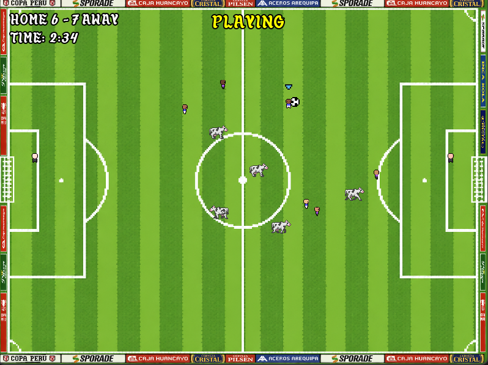

# Super Copa Peru Evolution

Arcade football with Peruvian chaos, wild momentum, and the occasional cow on the pitch.

Super Copa Peru Evolution is a C++ / SFML arcade football game inspired by the spirit of Copa Peru: Peru's famously chaotic, regional, anything-can-happen football competition.

## Quick Start: How To Play

Goal: score more goals than the opponent before the match timer ends.

| Action                  | Default Key |
| ----------------------- | ----------- |
| Move                    | WASD        |
| Pass                    | J           |
| Shoot                   | K           |
| Tackle / Steal          | L           |
| Switch Player (defense) | I           |
| Pause                   | Esc         |

## Features

- Player movement, ball control, passing, shooting, tackles/steals
- Match rules/state machine (kickoff, playing, game over)
- Goal detection and scoring
- Host-authoritative simulation (optional networked host/client)
- Snapshot-driven renderer (players, ball, cows, HUD, menus)
- Chaos event: cows enter the pitch and physically interfere with play

## Build

Requirements:

- CMake 3.15+
- A C++17 compiler
- Git
- SFML 3.1 (fetched automatically by CMake)

Build commands:

    git clone https://github.com/blayne-04/SPCE.git
    cd SPCE
    cmake -S . -B build
    cmake --build build

Executable output:

- build/bin/

## Run

Run the executable from build/bin/. Assets are copied there by the build.

## Project Structure

- `src/Common`: shared constants, packets, and types
- `src/Core`: core engine systems and renderer
- `src/Input`: player and AI input handling
- `src/Network`: host/client UDP networking
- `src/Objects`: players, ball, goals
- `src/Simulation`: world, match rules, physics helpers
- `src/States`: application states (menus, host/client/singleplayer)
- `tests/`: lightweight assignment test header
- `docs/media/`: screenshots and non-runtime media

## Development Team

Alphabetical order:

- Blayne Fuller
- Brian Reano Juarez
- Ryan Von Bereghy
- Santiago Pelaez

## License

This project is licensed under the MIT License. See LICENSE.md.
